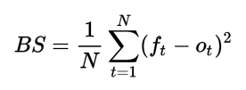
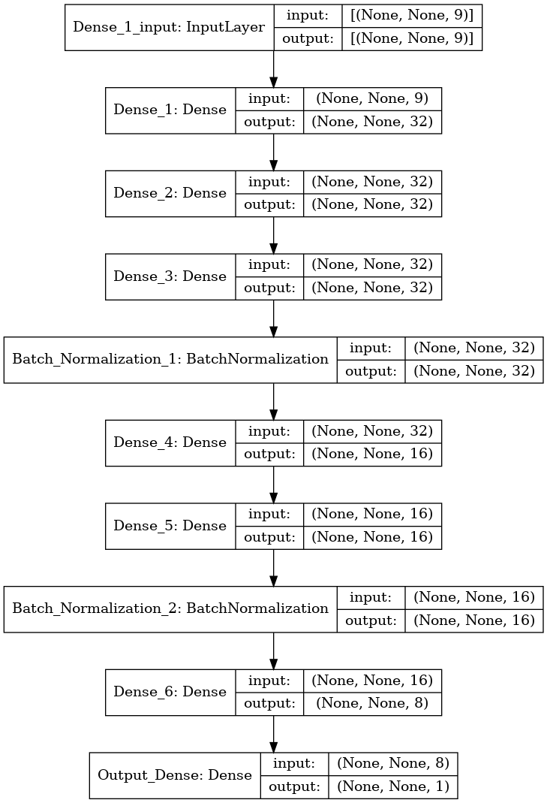

# Goldman Sachs Warsaw Quant Challenge
The winning solution to the problem of estimating the probability of winning the auction by posting a given price offer:

## Problem Description

#### Background
In this task you are taking part in a series of auctions for a financial product.
To guide bidding decisions, you are tasked with estimating the probability of
winning the auction by posting a given price offer. To build your model, you
are provided with data from past auctions. 
&emsp;&emsp;In such auctions you are typically offering a price that is lower than the
estimated value of the instrument, as this would allow you to make a profit.
Several factors may persuade a participant to bid at a price close to the value
or much lower than that, and these include:

* The true value of the products is unknown, so auction participants gener-
ally want to bid as low as possible to maximize their profit;

* Before you receive the product, its value can change due to market moves,
and some products may swing more than others;

* Demand for some of the products are higher and therefore they are more
valuable, while others are not;

* Some of the products are easier to sell quickly, while it will take longer for
others.

&emsp;&emsp;A lower bid is going to have a lower probability to succeed. Estimating such
probability as a function of the price helps the decision process in determining
what to bid in the future (out-of-sample).

#### Problem description
Your task is to build predictive model that estimates the probability you will
win an auction at a given bid price. 
&emsp;&emsp;Your training data set contains past auctions, with features describing their
outcomes – e.g., number of participants, how much you offered compared to the
value, whether you won it -, as well as information about the product – e.g.,
how liquid and desirable it was at the time of the auction. 
&emsp;&emsp;Below is the list of available features:
* Won - variable indicating whether you won the auction by offering price
(1 - ”true” or 0 - ”false”);
* Price - your offer, ie. your estimated value;
* Coupon - annual interest payments from the product;
* Notional - product feature indicating volume of the product;
* Maturity - feature indicating when it will expire;
* Sensitivity - sensitivity of the product value to the market moves;
* Liquidity - feature quantifying how quickly you can sell/buy significant
volume of the product on the market;
* Complexity - feature indicating product complexity, which impacts uncer-
tainty of product value estimation;
* Participant Count - feature indicate how many bids were submitted in the
auction for the product;
* Country - country of origin of the product.

#### Evaluation
You will be evaluated based on (out-of-sample) test data using Brier score, and
your methodology. Particularly, your model is expected to provide monotonic
probability with respect to the offered price, ie. when your offered price will
be 0, your probability of winning the auction should be 0.0, when your offered
price will became very large your probability of winning will tend to 1.0. 

&emsp;&emsp;Brier score:  
&emsp;&emsp;  
&emsp;&emsp;in which fi is your probability forecast, oi is the actual outcome of the event for trade i.

#### Submission
Submission should consist of:
* csv file named `[Name]_[Surname]_submission.csv` with the probability of
trade winning in one column
* code implementing your model or jupyter notebook

Please note, that:
* you are expected to submit probability of winning the auction not a binary
outcome;
* your model is expected to return higher probability of winning if price for
the same transaction would be higher.

## Solution
The complete solution is in the `solution.ipynb` file.

Here's the structure of the final DNN model it uses:

